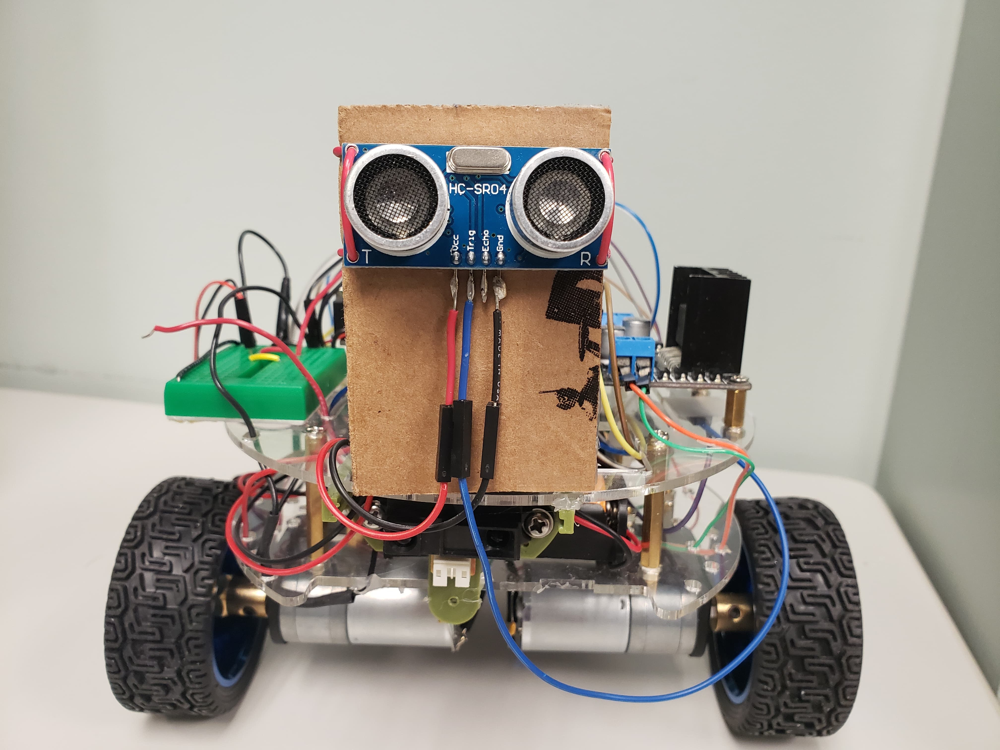
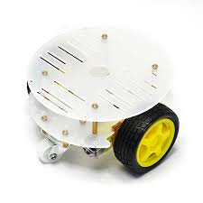
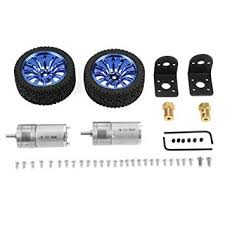
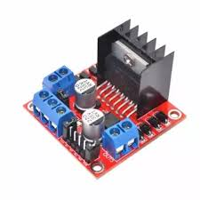
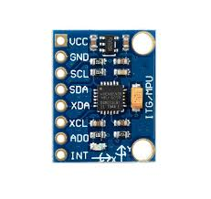
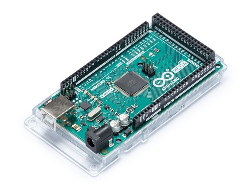
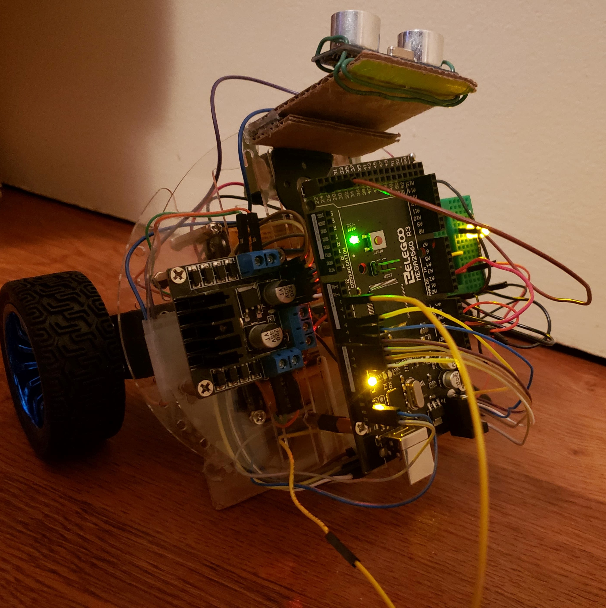

## I Introduction

The inverted pendulum model has been used to
recreate how human’s stand still.The study of this
concept has allowed us create self-balancing de-
vices.
When trying to create a self-balancing device, it is
recommended that the center of mass is located at
the top of the pivot points that requires constant
and active control in order to balance.
On this report, we will be discussing the tools and
steps used to create a self-balancing robot.

<p align="center">
 
</p>

```
Figure 1: View of Robot
```

## II Parts

Before moving to the implementation of this
project, research was done to find the best suitable
design for the body of the robot.

_A._ **_Chassis_**

For the body of the robot, I decided to use
the: **2WD MINI ROUND DOUBLE-DECK SMART
ROBOT CAR CHASSIS DIY KIT** , this kit was per-
fect for my implementation since it already came
with plenty of mounting spots for mounting and
routing the cables for the electronic pieces later
on.

<p align="center">
  
</p>

```
Figure 2: Chassis of Robot
```

_B._ **_Motor_**

For the motors, the parts used are: **2 pcs DC Gear
Motor Set DC 6V 280RPM 4mm Shaft with**

Mounting Bracket 65mm Wheel Kits 25GA
for Smart Car Robot DIY. A stepper motor
would have been the better option since they are
great in achieving and dealing with more precise
movements, however, due to limited budget, I
decided to go with the DC Gear motors as I
felt that they provided enough power and good
response time when it came to the balancing part
of the robot.


<p align="center">
  
</p>

```
Figure 3: Motor with Wheels
```

_C._ **_L298N Driver_**

The L298N is a dual H-Bridge motor driver that
allows the speed and direction of two motors at
the same time. This device can power DC motors
that have voltages between 5 and 35V, with a peak
current up to 2A.

<p align="center">
  
</p>

```
Figure 4: Motor Driver
```

_D._ **_MPU-6050_**

This device is potentially the most important piece
to make this project possible. The MPU-6050 is
a 6-DOF (degrees of freedom) or also known
as a six-axis IMU sensor, meaning that it gives
values as output: 3 values that come from the
accelerometer and 3 values from the gyroscope.

By using this chip, we can get accurate and fast
changes in position of the robot, allowing the
information to be sent to the motors, which then
rotate the wheels and therefore, help the robot stay
in balance.

<p align="center">
  
</p>

```
Figure 5: MPU-6050
```

_E._ **_Arduino Mega Micro-controller_**

The Arduino Mega 2560 is a micro-controller
board based on the ATmega2560. It has 54
digital input/output pins (of which 15 can be
used as PWM outputs), 16 analog inputs, 4
UARTs (hardware serial ports), a 16 MHz crystal
oscillator, a USB connection, a power jack, an ICSP
header, and a reset button. It contains everything
needed to support the micro-controller; simply
connect it to a computer with a USB cable or
power it with a AC-to-DC adapter or battery to
get started. The Mega 2560 board is compatible
with most shields designed for the Uno and the
former boards Duemilanove or Diecimila.

This device is the brain of the device, via this
micro controller we will be capable of controlling
all the devices that were mention before. It
connects all the parts together to achieve our end
goal of a self balancing robot.

<p align="center">
  
</p>

```
Figure 6: Arduino Mega 2560
```

## III Usage

To start the robot, ensure that the robot is in
the starting position as demonstrated in figure
7, while ensuring that the 9V battery is also
connected at the back of the robot and secure it.

Flip the power switch on the side of the robot
and slightly raise the robot and the robot should
balance itself.

<p align="center">
  
</p>

```
Figure 7: Starting Position
```

## IV The Problem

The problem is creating a self balancing robot that
is able to response to outside interfering, whether
it is someone pushing the robot or running into
a wall while maintaining the balance. As it was
briefly discussed in the introduction section, we
need to determined the values giving by the
MPU-6050.

The first step was to read the values from the
MPU-6050. This part was relatively easy thanks
to the MPU library; reading the values was
achievable.

After doing more research, I encountered an
issue that was noticed by the MPU-6050 and
the solution the libary offered.
Offsets needed to be calculated for each
MPU-6050 since not a single MPU-
is perfect by design. I achieved the offset
numbers by using the available program from
https://42bots.com/tutorials/arduino-script-
for-mpu-6050-auto-calibration/ which does an
automatic calibration. The values I got from this
calibration were the following:

```
mpu.setXGyroOffset(126);
mpu.setYGyroOffset(1); mpu.setZGyroOffset(12);
mpu.setXAccelOffset(-1488);
mpu.setYAccelOffset(-723);
mpu.setZAccelOffset(1100);
```

When The robot was being assembled, the battery
pack was placed at the bottom of the chassis
which it did not give the appropriate mass at
the top of the robot for the inverted pendulum
to be as effective as possible. This resulted in all
the other parts to be at the top of the chassis to
balance things out.

The next step was to place the MPU sensor in a
centralized position to read the values. By looking
at other people’s implementation, it became clear
that the MPU sensor needed to be placed exactly
at the center of the robot to get an accurately
map and track values based on the center of the
robot.

## V Solving The Problem

The steps to solving the problem were the
following:

Step 1: Finalize the position on how I wanted to
place the MPU sensor, vertically or horizontally,
this may not have seen like a major deal, but
base on the position which the MPU is placed,
different values needed to be read: yaw, pitch or
roll. I decided to place the MPU with the letters
facing up, having it set up this way I only need to
worry about the pitch values with I converted into
angle values by doing the following operation in
the code: ypr[1] * 180 / M PI + 180;
After the values were read, I needed to take
the values and make sure I made the wheels
respond accordingly. If a value is per se less
then 0 I have to turn the wheels towards that
direction (forward), else I move the wheels
towards the other direction (backwards). This,
at first, was a hard concept to grasp until
I stumble upon this guide for PID controls:
**[http://wired.chillibasket.com/2015/03/pid-](http://wired.chillibasket.com/2015/03/pid-)
controller/** This guide gave me a comprehensive
understanding on how to tackle this project and
credits go towards it.

## VI Libraries and Sources

Libraries:
I2Cdev
PID v
MPU6050 6Axis MotionApps20.h

```
Other Sources:
http://wired.chillibasket.com/
https://www.instructables.com/id/Arduino-Self-
Balancing-Robot-1/
https://maker.pro/arduino/projects/build-
arduino-self-balancing-robot
```

